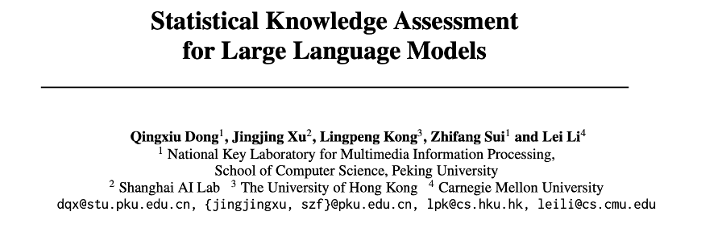
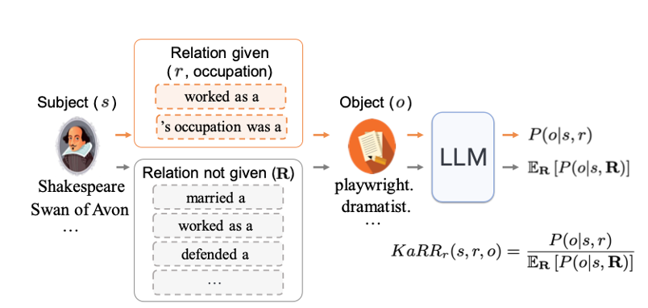
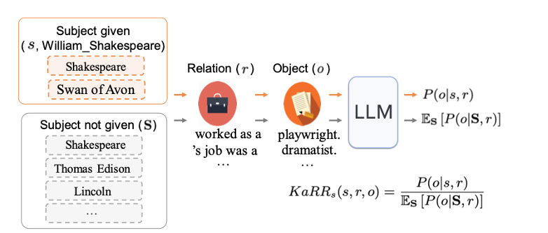
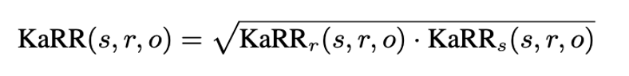
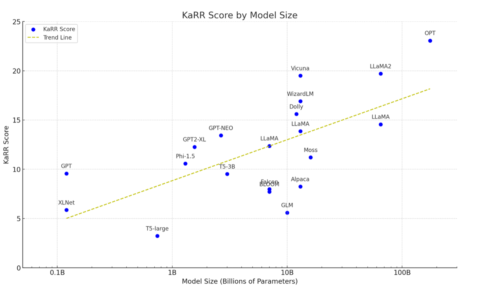
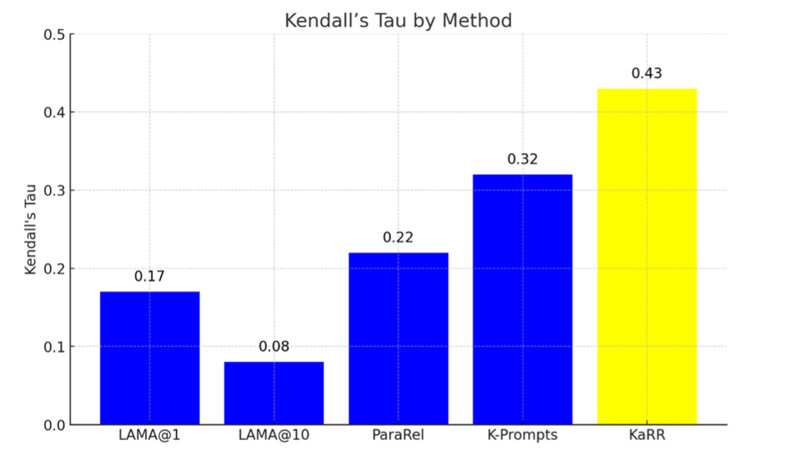
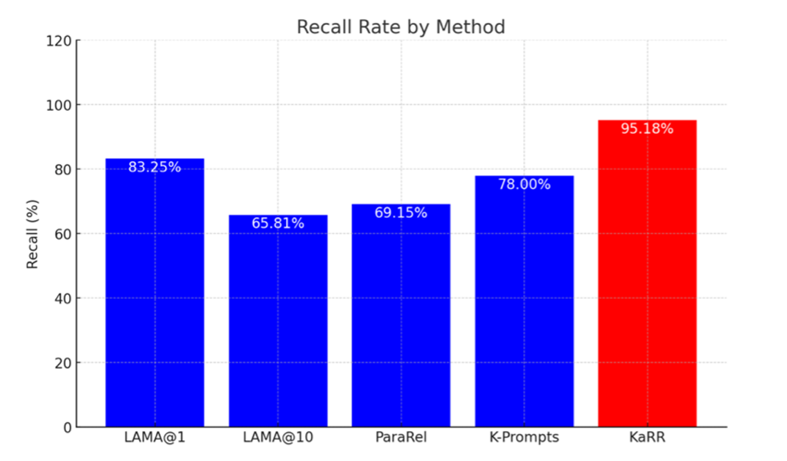
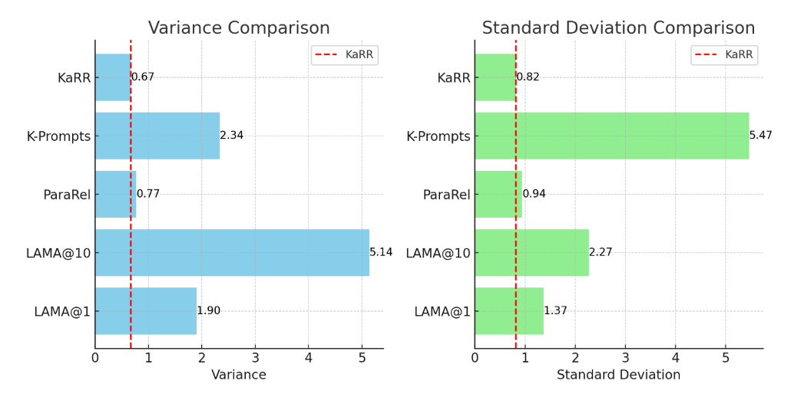

# Evaluating The Issue of Large Language Model Generating Unreliable Responses

Paper: https://arxiv.org/pdf/2305.10519

Code: https://github.com/dqxiu/KAssess

## Introduction & Background

Maybe because of their potent ability to assist with work and study efficiency or due to how they signify the future search engines, large language models (LLMs), such as ChatGPT, persist in having considerable popularity among the public nowadays. LLMs excel at doing many tasks, including summarizing papers & articles and generating content based on the prompt provided by the user.  However, LLMs are not invincible and can make mistakes, especially when they try to answer users’ questions. Many factors can contribute to the issue of LLMs generating wrong answers, including timeliness, the wording of the problem, and so on. Regarding timeliness, since LLMs are trained on data that includes information up to a certain period, they are highly unlikely to correctly answer questions related to events past that specific period. For instance, the training data of GPT-3.5 includes information up until January 2022. Hence, when I asked, “In which game did Caitlin Clark break the all-time scoring record?” it was not able to generate the correct answer since Caitlin Clark broke the record on March 3, 2024.


Moreover, how the questions are asked, such as the wording of inquiries, can also play a significant role in determining the reliability of the response generated by LLMs. Reliability here “refers to [LLMs’] ability to develop knowledge- correct text consistently” (Dong et al. 1). For instance, when ChatGPT was asked about the jobs of William Shakespeare, it correctly answered playwright and teacher. Yet, it answers “No” for the prompt “Is William Shakespeare a teacher” (Dong et al. 1)? The NeurIPS 2023 paper “Statistical Knowledge Assessment for Large Language Models” specifically examines the above issue of how the question’s wording can impact the reliability of the answer generated by LLMs and thoroughly explores how well LLMs can consistently generate reliable knowledge when given varying prompts.



## Problem

Typical users of LLMs are quite likely to find them intuitive to use since they only have to type what they hope the LLMs will do in their input fields. Yet, testing LLMs' general ability to generate reliable responses can be a daunting task. This is mainly due to the fact that varying the question prompts can lead LLMs to generate different answers and that there could be multiple text aliases for the same concepts. In addition, when LLMs are developed, they are trained on billions of textual input parameters instead of symbolic representations for specific concepts. Hence, it's difficult to measure their general understanding of concepts directly. For example, it is simple to test whether LLMs can correctly generate the response when asked, "What are the occupations of Williams Shakespeare?" However, measuring how much knowledge they have about Williams Shakespeare is hard.

## Previous Related Studies

The previous studies mainly focus on LLMs’ ability to generate accurate responses instead of reliable responses. The difference between accurate and reliable responses is crucial since accurate responses indicate responses that are factually correct for a given prompt. In contrast, reliable responses refer to how the generated responses are consistently correct across various prompts when asking for the same information. For specific examples, Petroni et al. [2019] introduced LAMA (LAnguage Model Analysis), which is used to study whether masked language models (MLMs), a kind of LLM, could correctly predict masked object entities . Yet, it mainly evaluated accuracy and did not account for reliability across different prompts. Another example is ParaRel, introduced by Elazar et al. [2021] . This method enhances LAMA’s evaluation ability by measuring the knowledge consistency of MLMs through several paraphrased prompts, but the prompts are semantically similar. Thus, it is still ineffective in measuring the generated responses’ reliability of LLMs. 

## Proposed Solution

The solution that the paper introduced is a statistical approach named Knowledge Assessment Risk Ratio (KaRR). The purpose of KaRR is to estimate the reliability of the LLM's ability to generate the correct textual form of the object given different prompts for the subject and relation. A subject, relation, and object example are William Shakespeare, occupation, playwright. Specifically, “KaRR quantifies the ratio of generating [correct object] text with and without a specified relation/subject” (Dong et al. 1). The specific calculation of KaRR includes two components: KaRRr and KaRRs. 

KaRRr is the ratio of the probability of generating the correct object given the subject and relation versus the likelihood of generating the object given only the subject, measuring the impact of specifying r or not on LLM generating o given s. Using the Shakespeare example, KaRRr measures the influence of explicitly stating the relation occupation, sex, and birth country in the prompt on the likelihood of LLM generating the correct response playwright, male, and England, respectively, when given the subject William Shakespeare. 



KaRRs is the ratio of the likelihood of generating the object given the subject and relation versus the possibility of generating the object given only the relation, measuring the impact of specifying s or not on LLM generating o given r. Using the same Shakespeare example, KaRRs evaluates the effect of explicitly specifying the subject William Shakespeare on the likelihood of the LLM generating the correct object playwright，male, and England, when the relation occupation, sex, and birth country is given in the prompt, respectively. 



The above notion of KaRRr and KaRRs can be widely applied, including using Caitlin Clark as an example. KaRRr measures, when given the subject Caitlin Clark, the influence of explicitly stating the relation college alma mater, height, and current team in the prompt on the likelihood of LLM generating the correct response University of Iowa, 6'00", and Indiana Fever, respectively. KaRRs evaluates the effect of explicitly specifying Caitlin Clark on the likelihood of the LLM generating the correct object University of Iowa, 6'00", and Indiana Fever when the relation college alma mater, height, and current team is given in the prompt, respectively.


To effectively address the impact of KaRRr and KaRRs, KaRR is calculated as the geometric mean of KaRRr and KaRRs.



## KaRR Testing Procedure

KaRR is applied to assess knowledge in different LLMs and to analyze its correlation with human assessments. Unlike LLMs, knowledge graphs like T-REx and Wikidata store structured information explicitly, which is ensured to be correct through manual construction and verification. Therefore, KaRR was based on these large knowledge graphs to test LLMs. The evaluation involved three model categories: traditional-size pre-trained models, such as XLNet, medium-size LLMs, such as GLM, and large LLMs, such as LLaMA. 

## KaRR Testing Results

The result of evaluating 20 LLMs using KaRR shows for small and medium-sized LLMs, most models’ KaRR scores ranged between 3 and 13, indicating that these models often have difficulty consistently generating factually accurate responses. On the other hand, the testing result of larger LLMs suggests that they generally have relatively higher KaRR scores than the small and medium-sized LLMs, confirming the scaling law of LLM knowledge, which states that larger models typically contain more factual knowledge. Moreover, the testing result shows that LLMs that are fine-tuned with instruction-following data, like Alpaca, had less knowledge reliability compared to those fine-tuned with data from more knowledgeable models, like Vicuna.



## Testing the Reliability of KaRR

Human evaluation was conducted on the LLM GPT2-XL to test the effectiveness and reliability of KaRR. The purpose is to observe whether the knowledge assessment result on GPT2-XL between KaRR and humans aligns. Specifically, the goals are to detect whether there is a correlation between KaRR scores and human-annotated scores for each fact (using Kendall's τ correlation) and to examine KaRR’s ability to evaluate GPT2-XL’s capacity to correctly identify and recall facts that are not consistently known by human.

The human evaluation includes volunteers who each wrote three prompts intending to probe the GPT2-XL knowledge from multiple angles. These prompts were refined based on the model's responses until the generated answers matched the expected type. The human evaluation also includes having annotators rate the generated responses from GPT2-XL. The average of these ratings for all prompts was used as the standard to assess the model's knowledge of that fact. To further increase the validity of the testing of KaRR's reliability, other analysis methods, such as LAMA, are used, and their evaluation results are used to compare with KaRR’s analysis result. 

The results showed the correlation value between different analysis methods and human evaluations, revealing how KaRR correlates considerably more with human-annotated results. Moreover, KaRR demonstrated a remarkable ability in true knowledge detection than other methods. This shows KaRR's substantial accuracy, effectiveness, and reliability in evaluating LLMs' reliable knowledge-generation capabilities.





To further discover how the evaluation results of knowledge-detection methods for LLMs are affected by the variation in question prompts, the study looks at the evaluation variance, which measures how much the assessment results vary when different paraphrased prompts are used, using the GPT2-XL model. The result shows that KaRR has high reliability since it has a low variance score (0.67) and standard deviation (0.82). In contrast, other analysis methods, such as LAMA and K-prompt, show significant evaluation result variations when the probing prompt is changed.



## Summary

The paper proposed a statistical knowledge assessment method called KaRR to determine the reliability of the generated response from different LLMs when given varying prompts. Applying KaRR on LLMs reveals the scaling law, where larger LLMs typically contain more factual knowledge and tend to generate more reliable responses. In addition, compared to other knowledge-detection methods, such as LAMA, KaRR has a higher correlation with human evaluation results and less variance in the evaluation result when the question prompts changes, indicating the trustworthiness of utilizing KaRR to evaluate the knowledge possessed by LLMs. 

This paper builds a solid groundwork for helping developers of LLMs tackle the problem of how LLMs could generate different answers when the same question is asked in various ways. Subsequent research could build upon KaRR and transform KaRR into an automatic and effective tool that could assist LLMs in generating reliable responses. A way this can be carried out is for LLMs to obtain a KaRR-derivation score whenever they generate a response. If the score is lower than a certain threshold, LLMs could automatically be prompted to reconsider the question and re-generate a more accurate answer. 


## Citation:
```
 @misc{dong2023statistical,
      title={Statistical Knowledge Assessment for Large Language Models}, 
      author={Qingxiu Dong and Jingjing Xu and Lingpeng Kong and Zhifang Sui and Lei Li},
      year={2023},
      journal = {Proceedings of NeurIPS},
} 
```

## References

1. What are large language models? - LLM AI explained - AWS. (n.d.). [https://aws.amazon.com/what-is/large-language-model/](https://aws.amazon.com/what-is/large-language-model/)
2. Fabio Petroni, Tim Rocktäschel, Sebastian Riedel, Patrick Lewis, Anton Bakhtin, Yuxiang Wu, and Alexander Miller. Language models as knowledge bases? In Proceedings of the 2019 Conference on Empirical Methods in Natural Language Processing and the 9th International Joint Conference on Natural Language Processing (EMNLP-IJCNLP), 2019.
3. Yanai Elazar, Nora Kassner, Shauli Ravfogel, Abhilasha Ravichander, Eduard Hovy, Hinrich Schütze, and Yoav Goldberg. Measuring and improving consistency in pretrained language models. Transactions of the Association for Computational Linguistics, 2021.

